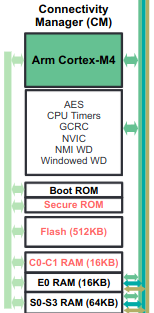

# F2838x_canopen

The objective of this repository is to provide a CANopen stack to run on the TMS320f2838x Texas Instrument microcontroller

## Important folders and files

- **f2838x_canopen.c**: Main source file for the project. Contains the `main` function as well as the timer ISR function for CANopenNode realtime periodic interrupt-thread
- **CANopenNode/**: CANopenNode git submodule. Ideally, files in this folder should not be modified
- **canOpenC2000/**: Folder for files required by CANopenNode but that can be modified
    - **CO_driver_target.h**: Driver structures definition and configuration defaults override. Created based on the one from *CANopenNode/examples/* as some structure members are actually required from outside the driver implementation
    - **CO_driver.c**: Implementation of the driver functions
    - **CO_storage.c/h**: Not sure what this does but CANopenNode requires some implementations inside to compile properly. Copied from *CANopenNode/examples*
    - **OD.c/h**: Object Dictionnary definitions and implementation
- **2838x_X_lnk_cm.cmd**: Linker scripts to define the memory attribution for the different code sections
- **device/**: Driverlib files to initialise the CM core
- **device/driverlib_cm**: Driverlib files with functions to manage the different devices of the uC

## Microcontroller

The F2838x uC is part of the C2000 microcontroller family 

### CM (Cortex-M0) Core

The Communication Manager core is an ARM Cortex-M0 core and has access to the CAN module. After a reset, this core is disabled and it has to be activated by CPU0. From CCS however, it can be activated by the debugger by selecting it in the list of core and launching the program

### CAN module

The CAN module of the f2838x uC is based on the DCAN IP. This IP is based on a RAM memory that stores up to 32 objects containing informations on CAN frames that should be received or transmitted like the identifier, DLC, data and mask (to filter the received frames). Message objects can be configured so an interrupt is sent once a CAN frame is received or transmitted.

Message objects aren't accesible directly and have to be accessed via one of the memory mapped interface registers provided by the device. Configuration and transmission and data reception can be done using the driverlib functions but updating DLCs and identifiers has no attributed driverlib function and has to be done by accessing the registers directly

The CAN module may also be configured to send interrupts when an error is detected or when its status changes

## CANopenNode

CANopenNode is a CANopen open-source stack. It handles the features of the CiA301 CANopen protocol as well as some extensions. Effectively used features are defined at compile time using defines from the configuration files (see below)

### CAN module driver API

CANopenNode is written to be generic and provides a *CO_driver.h* file with function prototypes that need to be implemented for it to communicate with the CAN module. Functions can be implemented in a *CO_driver.c* file and a *CO_driver_target.h* file can be used to declare structures internal to the driver. Both files are examplified in the *examples/* folder and it is a good idea to use those as reference as the APi is sadly not as encapsulated as one might expect: some fields of the declared structures are indeed only used in the driver but others are used in the main code and are thus mandatory. 

The internal code of CANopenNode relies on objects for each CANopen feature (NMT, EMERGENCY, SDO, PDO...). As long as the amount of objects isn't superior to 32, the CAN module's message objects can be used to handle the objects and the data they send/receive. Assigning all the reception (rx) objects (`CANrxBuffer_t`) before the transmission (tx) objects  (`CANtxBuffer_t`) in the message objects allows for fast matching tx/rx object \<-> message object

### User

The stack relies on threaded functions to manage timed (like OD management) or asynchronous (like CAN reception) tasks. In this context, those are handled using interrupts

### OD

CANopenEditor is an Object Dictionnary editor capable of generating source code for CANopenNode to use to define the OD structures. The generated file also configures the amount of each CANopenNode OD object (NMT, PDO,...). This allows users to create custom ODs depending on the CANopen profile they would like to use for their project. However, generating a file with this utility doesn't seem to be foolproof as trying to compile the project using a custom one lead to build errors so some tinkering might be necessary

### Configuration

Core features of the CANopen protocol (defined in the CiA 301 file and implemented in the *CANopenNode/301* folder) are configured in the *canOpenC2000/OD.h* file. A basic example file has been recovered from *CANopenNode/examples*

Currently disabled extensions of CANopen (Default configuration overrides are made in the *CO_driver_target.h* file):

* LSS
    * Allows the CANopen nodes in a network to be configured by other nodes. For testing and in simple networks, it might be simpler to leave this one out
    * Disabled by setting `#define CO_CONFIG_LSS 0`
* LED
    * Allows for a LED to be controlled through CANopen
    Disabled by setting `#define CO_CONFIG_LEDS 0`

## CCS

### C2000Ware and driverlib

C2000Ware is a collection of example projects, documentation and driver code (driverlib) for the C2000

Driverlib is driver code to be used to access, manage and configure the chip's devices. For this uC, since two different kinds of core exist, make sure to always use the examples and driverlib for the CM core

#### Install

In CCS, the C2000Ware package can be downloaded in the Resource Explorer. Go into *View* > *Resource* Explorer and then, on the left of the opened window, open the *C2000 real-time microcontrollers* > *Embedded Software* folder. Hovering over *C2000Ware-{version number}* will make three dots appear; click on it and select install to install the package

### Project

Repository contains all the files necessary to open it as a project in CCS. However the paths in the configuration might not correspond to the ones on your drive. Right-click on the project name and select *Properties* to adapt it to your hierarchy

#### Program sections attribution

The *2838x_RAM_lnk_cm.cmd* file declares RAM blocks and flash banks available and assigns the program sections to them if some section takes too much space, it will be split and put on separate blocks. Assigning multiple possible blocks for a section is done by listing them separated by "|". In the *View* > *Memory Allocation* view, the different banks and blocks are listed and the associated drop-down menu shows the sections that were allocated on it during the last build. Hovering over the blocks shows the amount of used and available memory and the sections show the amount of "units" (bytes apparently) they occupy

CM core memory blocks diagram

#### Heap/stack memory allocation

The heap (.sysmem) and stack (.stack) sections' size isn't deduced but set in the linker options. In the project's properties, go to *CCS Build* > *Arm Linker* > *Basic Options* and set the desired value for the stack and heap in the penultimate and ante-penultimate fields respectively. In this project, a heap size increase was necessary to provide enough memory for all the OD objects allocated by CANopenNode

#### Project creation

When creating a new driverlib project, it is a good idea to start from an empty driverlib project such as the one available in the C2000Ware resource explorer example folder. In the Resource Explorer, go to the C2000Ware folder and then look for *English* > *Devices* > *F2838XD* > *F28388D* > *Examples* > *Driverlib Empty CM Example CCS Project*. Click on the three dots that appear next to it when hovering over it and select *Import to CCS IDE*

Once the import is finished, add the necessary folders containing the code that you want to compile. In this case, the folder containing the CANopenNode code, the folder containing the CANopenNode driver implementation and the code with the `main` function (See hierarchy description above)

Go to the Project Explorer, locate the *driverlib_cm.lib* file and remove it. In the project properties go to *C/C++ General* > *Paths and Symbols* and go to the *Source Location* tab. Click on *Add Folder ...* and add the *device/driverlib_cm* folder from the project's hierarchy. In the *Includes* tab, make sure to include the folders you have imported into the hierarchy

CANopenNode also contains C99 constructs (such as for-loop variable declaration) that won't play nicely with the default C89 option of the compiler. In the project properties, go into *CCS Build* > *Arm Compiler* > *Advanced Options* > *Language Options* and in the field in front of *C Dialect*, select *Compile program in C99 mode*

When compiling CANopenNode, make sure the "examples" folder is excluded from the build as the code it contains might cause errors since it isn't meant to actually be used. Right-click on the folder and choose *Exclude from Build*

## Current problems and limitations

The stack requires critical section protection to guarantee some data transfers are made safely between the User, stack and CAN module but I wasn't able to find how to implement them on the uC. It could also be that because the stack uses interrupts instead of actual threads, critical section isn't feasible since blocking an ISR is out of the question

Current driver only allows tx objects to send one frame to their dedicated message object. If new data is sent to the message object before the previous is sent, an error occurs and the new data is not memorised by the driver

Support for syncPDOs in the driver is not guaranteed to function as is (see comments above related driver function)